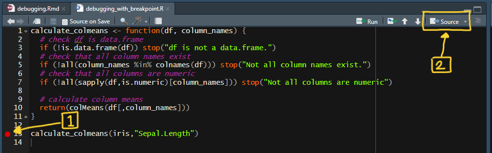

# Package Installation

```{r setup, include=FALSE}
# This will install tidyverse package if it's not already installed
if (!("tidyverse" %in% installed.packages()[,"Package"])) {
  install.packages("tidyverse")
}

library(tidyverse)
```

**NOTE**: You will need to render the markdown file inside the console with `rmarkdown::render(file.path(getwd(),"debugging.Rmd"))` to have some functions show correct output. If that doesn't work (i.e. file does not exist error), you will have to check the output of `getwd()` and get the right directory name that contains this document.

# Intro

**Debugging** is a process of finding and fixing errors or bugs in your code. When your code doesn't run or return values as expected, you can use various tools and approaches to examine your code and then determine why it doesn't run as it should.

This workshop will guide you through general strategy with debugging your code and introduce you to various debugging tools offered in R and R Studio.

The materials in this workshop has been inspired by Hadley Wickham's [Advanced R](https://adv-r.hadley.nz/index.html) book, which I recommend if you would like to learn more about advanced aspects of R.

## Recommendations for Troubleshooting

What are some steps you could take to identify issue with your code?

1.  Try Google search. You can search the exact error message on Google, and look for other users who may have had similar issues and were able to solve the issue. You could also try keyword search on [Rstudio community](https://community.rstudio.com/) or [stackoverflow with [r] tag](https://stackoverflow.com/questions/tagged/r).

-   Also try consulting ChatGPT by asking specific questions about the error messages or unexpected behaviors! It will reply with relevant information that can help you identify the issue. Just be aware that ChatGPT may commit errors, so use it with caution. It will be useful to identify where your bug might be, but do not run something it recommends if you don't know exactly what it will do.

2.  Try restarting R session. Oftentimes you might have unintended variables or packages loaded into your environment that is messing with your code.

3.  Try making the error / bug repeatable. Creating a **Repr**oducible **ex**ample helps you figure out the root cause of the problem, and helps others understand the exact problem you are running into. If possible, try to create an example with small and simple test cases, which can help think more directly about the problem.

### reprex example

Suppose you're having trouble with creating a scatter plot with colors in `ggplot2`. You would like to ask on stackoverlow, but you don't want to share your data. You can create an example dataset (or use dataset available in R), and demonstrate what you have done so far in your program. It helps the helper focus on the core problem if you can simplify your problem.

**Question**: How can I create a scatter plot with data points colored based on a column? I've tried setting `color=` as the column name inside `geom_points()`, but I'm getting an error.

```{r reprex_example, error=TRUE}
set.seed(5)

mydata <- data.frame(
  x_coord = runif(10), # generate 10 random numbers
  y_coord = runif(10), # generate 10 random numbers
  color_column = c(rep("Category 1",5),rep("Category 2",5))
)

# head(mydata)
#     x_coord   y_coord color_column
# 1 0.2002145 0.2732849   Category 1
# 2 0.6852186 0.4905132   Category 1
# 3 0.9168758 0.3184040   Category 1
# 4 0.2843995 0.5591728   Category 1
# 5 0.1046501 0.2625931   Category 1
# 6 0.7010575 0.2018752   Category 2

ggplot(mydata) +
  geom_point(aes(x = x_coord, y = y_coord), color = color_column)
```

In the following section, I will introduce you to some examples and tools you can use to identify the root cause of the problem.

# `print()` Debugging

If you have a bug in your function, one common approach is to utilize the `print()` statement to print the value of objects during the execution.

Bugs can commonly occur due to conflicting data structures, in which case using `str()` can be helpful too. (`str()` function displays the structure of an R object.)

```{r}
# structure of a numeric vector
x <- 1:5
str(x)

# structure of a data.frame
str(iris)
```

Let's start with a simple example. In this example, I have `f1()`, which calls `f2()` and `f3()` sequentially.

```{r traceback_simple_example, error=TRUE}
# call f2() and f3()
f1 <- function(x1) {
  f2(x1)
  f3(x1)
}

# will throw an error if x is not numeric type
f2 <- function(x2) {
  x2 + 2
}

# will throw an error if x is not character type
f3 <- function(x3) {
  strsplit(x3,",")
}

f1("Hello, world!")
```

There is clearly a problem with this function, so I will put print statements throughout the function to leave trails of `x1`.

```{r print_debugging_simple_example, error=TRUE}
# call f2() and f3()
f1 <- function(x1) {
  # print beginning of the f1() function and show "x"
  print("f1():")
  print(paste("x1:",x1))
  
  # print beginning of the f2() function, and then run f2()
  print("Running f2():")
  f2(x1)
  
  # print successful execution of f2()
  print("f2() run successfully!")
  
  # print beginning of the f3() function, and then run f3()
  print("Running f3():")
  f3(x1)
  
  # print successful execution of f3()
  print("f3() run successfully!")
}

# will throw an error if x is not numeric type
f2 <- function(x2) {
  print(paste("in f2(): x2:",x2))
  x2 + 2
}

# will throw an error if x is not character type
f3 <- function(x3) {
  print(paste("in f3(): x3:",x3))
  strsplit(x3,",")
}

f1("Hello, world!")
```

## Example Using `iris`

Let's try utilizing this with the `iris` dataset. I'll create a function that accepts column names and calculates the column means. I want to be a good programmer and try to account for all the cases in which the function might fail. These cases include:

-   supplied data is not of `data.frame` type
-   column names don't exist
-   columns are not numeric

```{r print_debug_colmean_function}
calculate_colmeans <- function(df, column_names) {
  # check df is data.frame
  if (!is.data.frame(df)) stop("df is not a data.frame.")
  # check that all column names exist
  if (!all(column_names %in% colnames(df))) stop("Not all column names exist.")
  # check that all columns are numeric
  if (!all(sapply(df,is.numeric)[column_names])) stop("Not all columns are numeric")
  
  # subset columns
  df_subset <- df[,column_names]
  column_means <- colMeans(df_subset)
  
  # calculate column means
  return(column_means)
}
```

Let's see if the function works as intended

```{r colmean_function_check, error=TRUE}
head(iris)

# should run successfully
calculate_colmeans(iris, c("Sepal.Length", "Petal.Length", "Petal.Width"))

# should return an error - second column doesn't exist
calculate_colmeans(iris, c("Sepal.Length", "petal.length"))

# should return an error - second column is a factor
calculate_colmeans(iris, c("Sepal.Length", "Species"))
```

Looks like the function is running as intended. Let's try with one column.

```{r colmean_function_fail, error=TRUE}
# should run succesfully
calculate_colmeans(iris, c("Sepal.Length"))
```

That's weird - looks like although the column name does exist and is numeric, I'm getting an error. According to the error, there is an error with the `colMeans` function, and there's something about dimensions in `x` that is causing an error. It's pretty straightforward where the error occurs. We should figure out what's wrong with the value being supplied, so let's print out what's being passed onto `colMeans`.

```{r add_print_colmean_function, error=TRUE}
# redefine function with print statement inside
calculate_colmeans <- function(df, column_names) {
  # check df is data.frame
  if (!is.data.frame(df)) stop("df is not a data.frame.")
  # check that all column names exist
  if (!all(column_names %in% colnames(df))) stop("Not all column names exist.")
  # check that all columns are numeric
  if (!all(sapply(df,is.numeric)[column_names])) stop("Not all columns are numeric")
  
  # subset columns
  df_subset <- df[,column_names]
  
  # print df_subset
  print("df_subset:")
  print(head(df_subset)) # print first 5 rows since it can be long
  print("Structure:")
  str(df_subset) # print structure of df_subset
  
  column_means <- colMeans(df_subset)

  return(column_means)
}

calculate_colmeans(iris, c("Sepal.Length"))
```

Printing out the object and the structure shows that we are passing a vector, not a data frame inside `colMeans()`. We can confirm that this is indeed what's causing the issue by reproducing the error.

```{r colmean_fail_example, error=TRUE}
colMeans(1:5)
```

Let's run the previous example:

```{r colmean_function_success_example}
calculate_colmeans(iris, c("Sepal.Length", "Petal.Length"))
```

In this case, we get a data.frame instead of a vector. It looks like the number of columns we pass affects which data structure is returned when we subset based on column:

```{r df_subsetting}
# one column
head(iris[,c("Sepal.Length")])

# two columns
head(iris[,c("Sepal.Length", "Petal.Length")])
```

To prevent this from happening, we can either use the `select()` function from `dplyr` package, or use the `drop=FALSE` argument when subsetting the data frame.

```{r}
# one column
head(iris[,c("Sepal.Length"),drop=FALSE])
```

```{r colmeans_function_resolved}
calculate_colmeans <- function(df, column_names) {
  # check df is data.frame
  if (!is.data.frame(df)) stop("df is not a data.frame.")
  # check that all column names exist
  if (!all(column_names %in% colnames(df))) stop("Not all column names exist.")
  # check that all columns are numeric
  if (!all(sapply(df,is.numeric)[column_names])) stop("Not all columns are numeric")
  
  # calculate column means
  df_subset <- df[,column_names,drop=FALSE]
  column_means <- colMeans(df_subset)

  return(column_means) # add drop=FALSE option
}

calculate_colmeans(iris, c("Sepal.Length"))
```

## Exercise 1

Sometimes bugs might not necessarily throw errors, but still return undesirable results (sometimes with a warning).

In this exercise, I developed a function that takes a vector of `factor` type where levels are integers, and returns another vector (`factor` again) after adding 1. Try to figure out the problem with this code using print statement and fix the problem.

**HINT:** `as.integer(as.character(x))` converts factors to integers as written.

```{r}
add_one_to_factor <- function(x) {
  stopifnot(is.factor(x)) # checks that x is factor type
  stopifnot(all(grepl("^[[:digit:]]+$", x))) # checks that all levels are integers
  
  factor_to_integer <- as.integer(x)
  new_x <- factor_to_integer + 1
  new_x <- as.factor(new_x)
  
  return(new_x)
}

example_x <- factor(c('1','3','6','10'))
add_one_to_factor(example_x) # expect 2,4,7,11
```

Printing the output is one of many approaches to identifying and solving bugs. When working with a large code base, it can get unwieldy especially with many layers of functions, where you might have to constantly add and delete print statements.

However, it can be a good start to debugging your code especially when you aren't able to get a good traceback (happens quite often with `dplyr` or `ggplot2` functions) or are having a hard time identifying the source of the problem.

# Locating Error with `traceback()`

When you get an error in your code, you want to figure out which part is causing the problem. `traceback()` helps by printing the sequence of calls that lead to the error.

If you are working on a Quarto / R Markdown document in R Studio, you will get a "Show Traceback" option on the right side of the chunk output, which lets you view the *call stack*, which is a sequence of function calls.

(This option should also show in the console output if you are working with an R script. Unfortunately I am not able to resolve an issue where this doesn't show.)

If you are not running on R Studio, you can use `traceback()` to get the same information.

Let's work with the same example.

```{r traceback_simple_example, error=TRUE}
# call f2() and f3()
f1 <- function(x1) {
  f2(x1)
  f3(x1)
}

# will throw an error if x is not numeric type
f2 <- function(x2) {
  x2 + 2
}

# will throw an error if x is not character type
f3 <- function(x3) {
  strsplit(x3,",")
}

f1(3)
```

```{r}
traceback()
```

The output of `traceback()` is in the order of the most "inner" function to the "outer" function. Therefore you can read the output from bottom to top to understand which function leads to the next and eventually leading to the final error.

In the following section, we will explore several powerful debugging options that allow you to "pause" the execution of a function and interactively explore.

# Interactive Debugging with `browser()`

Much like `print()`, you can embed `browser()` inside a function. Instead of printing a specific value, this will pause the execution at the location and start an interactive debugger session.

Inside an interactive session, you can run any R command. You can look at objects, modify them, and control when to run the next line in the function.

There are additional commands while in this session that allow you to navigate through the code. These can be invoked by typing the keyword and pressing enter.

-   `n` (**n**ext): execute the next step in the function
-   `s` (**s**tep into): similar to "next", but if the next step is a function, it will step into the function and let you explore
-   `f` (**f**inish): finish the execution of current loop or function
-   `c` (**c**ontinue): finish running the rest of the code and exit the interactive session.
-   `Q` (**Q**uit): terminate the interactive session
-   `where`: prints the stack trace (equivalent to `traceback()`)

Let's explore the interactive session with the example from before (with a slight change to `f2()`.

**NOTE**: if the code is run from a chunk, the interactive session may not print the output of some objects to the console. You can either run this in an R Script, or copy and paste to the R console.

```{r debugger_example_2, error=TRUE, eval=FALSE}
# call f2() and f3()
f1 <- function(x1) {
  browser() # insert browser() here
  x1 <- f2(x1)
  f3(x1)
}

# throw error if x is not numeric type
f2 <- function(x2) {
  for (i in 1:5) {
    x2 <- x2 + 1
    x2 <- x2/2
  }
  return(x2)
}

# throw error if x is not character type
f3 <- function(x3) {
  strsplit(x3,",")
}

f1(5)
```

## Exercise 2

Try inserting `browser()` inside `calculate_colmeans` and explore the function. Note that you can choose to insert the `browser()` statement anywhere in the function, and it will start the interactive session at that place.

```{r error=TRUE, eval=FALSE}
# original function
calculate_colmeans <- function(df, column_names) {
  # check df is data.frame
  if (!is.data.frame(df)) stop("df is not a data.frame.")
  # check that all column names exist
  if (!all(column_names %in% colnames(df))) stop("Not all column names exist.")
  # check that all columns are numeric
  if (!all(sapply(df,is.numeric)[column_names])) stop("Not all columns are numeric")

  # subset columns
  df_subset <- subset_data_frame(df,column_names)
  column_means <- colMeans(df_subset)

  # calculate column means
  return(colMeans(df_subset))
}

subset_data_frame <- function(df, column_names) {
  df_subset <- df[,column_names]
  return(df_subset)
}

calculate_colmeans(iris, "Sepal.Length")
```

## Exercise 3

I created a function, `calculate_geometric_means`, that calculates geometric mean of specified columns in `x`. (It's not important what geometric mean is in this exercise, but you can learn more about it [here](https://en.wikipedia.org/wiki/Geometric_mean))

I also created helper functions to check that the vector is numeric, and check that all numbers are positive. If there are negative numbers, I convert them to absolute values.

Try to identify the bugs inside this code and fix them.

```{r error= TRUE,eval=FALSE}
# raise error if x is not numeric
check_numeric <- function(x) {
  if (!is.numeric(x)) stop("Error in check_numeric(): x is not numeric")
  invisible()
}

# check that all numbers are positive. If not, use absolute value.
all_positive_numbers <- function(x) {
  if (x > 0) {
    return(x)
  } else {
    return(abs(x))
  }
}

# calculate mean of the log values
geometric_mean <- function(x) {
  check_numeric(x)
  x <- all_positive_numbers(x)
  output <- exp(mean(log(x)))
  return(output)
}

# calculate geometric mean of x with grouping defined by vector y
calculate_geometric_means <- function(x, columns) {
  for (column in columns) {
    x <- geometric_mean(x[,column])
    print(paste0(column, ": ", round(x, 4)))
  }
}

calculate_geometric_means(iris, c("Sepal.Length", "Sepal.Width"))
```

# Recap

In this workshop, I introduced you to several debugging tools and approaches to help you locate the source of error and figure out the problem. You can use `traceback()` and `print()` to help locate the source of error, which can be enough to fix the issue with your code. You can then utilize interactive sessions by leveraging `browser()`, breakpoints, and `debug()` to explore potential problems in your code and test your hypothesis.

Although it may seem tedious at first, being able to utilize a systematic approach can help cut down the time spent looking for the root cause of the problem and proposing a solution.

## Additional Debugging Options

Due to time constraint of the workshop, we haven't been able to explore other options for debugging. This section contains information on how to use breakpoints and `debug()` to debug your code.

### Traceback With `rlang` Package

`rlang` is a package that is extensively used by `tidyverse`. This package provides a set of tools to interact with and display errors in R. `last_trace()` displays the traceback in more readable format.

Traceback with rlang doesn't play well with code chunk in R Markdown, so the following chunk has to be run as a whole. Place cursor inside the code chunk, and then:

-   for Windows: type `ctrl + shift + enter`
-   for Mac: type `cmd + shift + enter`

```{r rlang_traceback, error=TRUE, message=TRUE, warning=TRUE}
# this option is necessary to use rlang
options(error = rlang::entrace)

f1(3)

rlang::last_trace()

options(error = NULL) # default option is NULL. reset to this option
```

**Quick Aside:**

The `options()` function allows us to examine and set a variety of global options that affect how R computes and displays its results.

Example with `digits=` option (default is 7):

`digits=` controls number of significant digits to print.

```{r}
cat("With default digits option:", 1/123456, "\n")
options(digits = 2)
cat("With new digits option:", 1/123456, "\n")
options(digits = 7)
```

### Using breakpoints

In Rstudio, you can also set breakpoints to activate the interactive debugging session:

1.  Click on the left side of your line number where you desire to start debugging.
2.  Either click on "Source" in the top right part of your script, or run `debugSource("PATH_TO_YOUR_SCRIPT/debugging_with_breakpoint.R")`, where `PATH_TO_YOUR_SCRIPT` is the location of your script.



This does not work in R Markdown, so I will demonstrate this in an R script `debugging_with_breakpoint.R`.

### `debug()` / `debugonce()` / `undebug()`

The last approach I will show you is with `debug()`. `debug()` will basically insert `browser()` in the first line of your function, entering the interactive session when you call your function.

To stop this behavior, you can call `undebug()` on your function.

```{r,eval=FALSE}
# insert the function you would like to debug inside debug()
debug(calculate_colmeans)

calculate_colmeans(iris,"Sepal.Length")

undebug(calculate_colmeans)
```

Running `debugonce()` will run this interactive session just once.

## Additional notes

I highly recommend [this chapter](https://adv-r.hadley.nz/debugging.html#debugging) from [Advanced R](https://adv-r.hadley.nz/index.html) if you would like to learn more about debugging. This chapter goes into much more detail including cases with lazy evaluation, even more debugging tools and approaches, and what to do when debugging in R Markdown.
